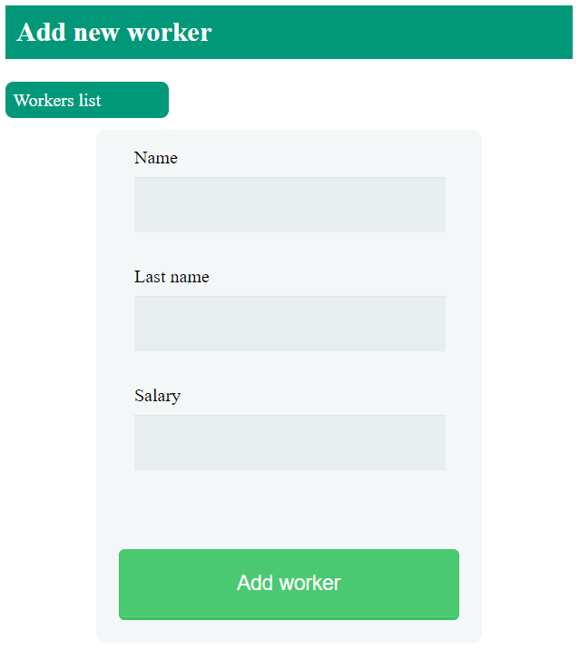
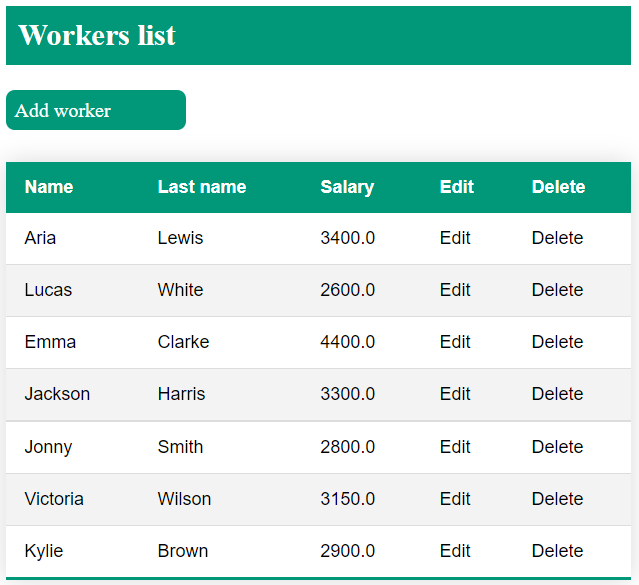

# Web Worker Manager

## General Information
Inspired by application to manage workers. 
The application that helps at managing workers by 
an edition in the database.

## Screenshots

### Worker form

### Table with workers

## Technologies Used
- Java
- JSP
- MySQL
- CSS
- XML
- Maven
- MVC

## Features
- Table with data of workers
- List of workers button
- Add worker button
- Edition button for each worker
- Delete button for each worker

### Functions
- Add new workers to database
- Edition of workers data
- Delete of worker
- Display a list of workers data

## Usage
Install and use Tomcat and Xampp 
(modules Apache and MySQL). Next Build ”mvn package” 
(file web-worker-manager.war) at terminal. 
Next copy file to folder apache-tomcat. 
Next enter ”localhost:8080/web-worker-manager/list” 
to browser window.

## Room for Improvement
- Table with departments